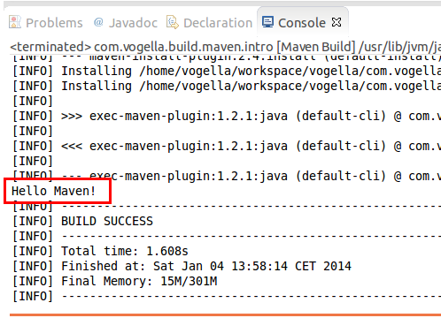

[[example_executejavaprojgram]]
== Exercise: execute a Java program with Maven

If you want to execute a program you can use the `exec-maven-plugin`. 
This is demonstrated in the following _pom.xml_	file. 
To trigger this use the `exec:java` target in maven.
	
[source,terminal]
----
include::res/simple/pom2.xml[]
----
	
[source,terminal]
----
include::res/simple/pom2.xml[]
----

