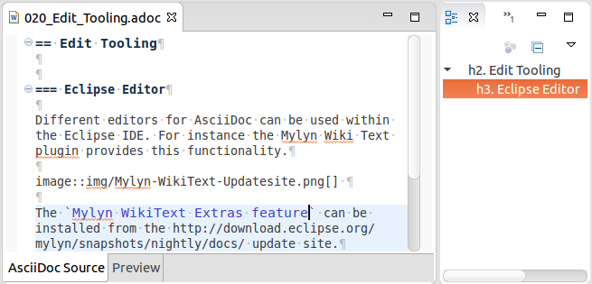
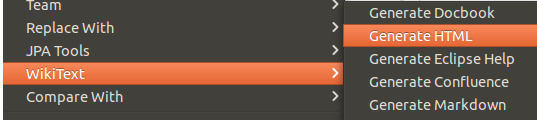
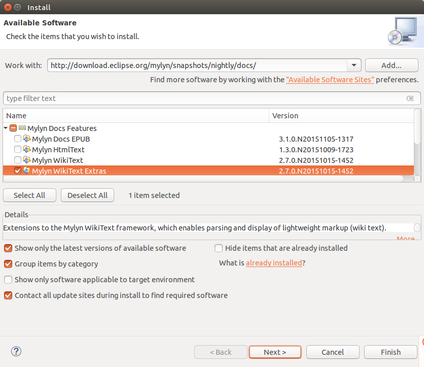

== Edit Tooling

=== Eclipse

Different editors for AsciiDoc can be used within the Eclipse IDE. 
For instance the Mylyn Wiki Text plugin provides this functionality.

 

Different outputs from the AsciiDoc file can be generated by using the `WikiText` popup menu of an AsciiDoc file.

 

The `Mylyn WikiText Extras feature` can be installed from the http://download.eclipse.org/mylyn/snapshots/nightly/docs/  update site.

 

More information can be found here: https://wiki.eclipse.org/Mylyn/WikiText/AsciiDoc

