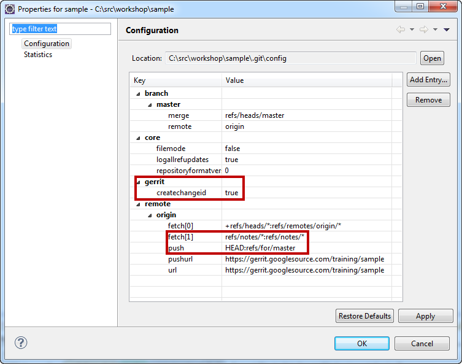

[[exercise_configurepushtogerrit]]
== Configure Gerrit contributions

In this exercise you learn how you configure your local repository for
the work with Gerrit.

=== Preparation

Go to the Gerrit server https://git.eclipse.org/r/ and login the server with your Eclipse Bugzilla account.

Clone the example repository from an URL found on the following URL via the link
which includes your user:

https://git.eclipse.org/r/#/admin/projects/sandbox/egit-training

Do a fresh clone and do *not* re-use any existing local clone of the
example repository. The reason for this is that the
work with Gerrit requires the usage of Change-Id's in the commit
messages and the commits created during the Git exercises do not have
Change-Id's. To avoid trouble with missing Change-Id's we recommend to
clone the repository newly for the Gerrit exercises.

=== Configure the remote

If you clone the repository via Eclipse Git, no additional configuration is needed to push to Gerrit.

In case you cloned via the Git command line, open the node 'Remotes' of your repository in the Git Repositories
View and choose 'Gerrit Configuration...' from the context menu on the
'origin' repository.

image::img//gerrit-configuration.png[Gerrit Configuration]

Normally you can keep the default values in this Wizard page and
confirm with 'Finish'.

=== Resulting Repository Configuration
You can check the result in the configuration of the local repository.
Select 'Properties' from the context menu on the repository node in
the Git Repositories View.

