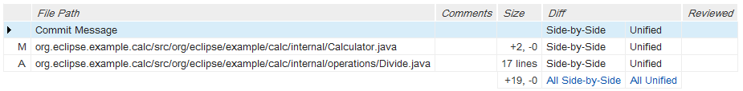
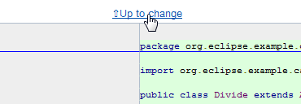
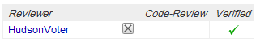

== Review a Change
In this exercise you will do a code review in Gerrit.
You can review your own change or a change created by somebody else.
In practice you should review changes of others and others should
review your changes. Therefore, try to find a change (for
the 'egit-training' project) not created by you and use it for this
exercise.

A review of a simple change is usually done only from Gerrit. However,
for a more complex change you may want to fetch it into your local Git
repository, build it and look at it from Eclipse.

=== Review the source code changes from Gerrit

A change consists of one or more patch sets. One patch set corresponds
to one Git commit. When a change has more than one patch set it is
only necessary to review the latest patch set! This is an important
principle in Gerrit to remember.

Look at the list of files under the latest patch set (patch set 1 in this case). These are the files that were added, modified or deleted within this change.

NOTE: In addition to the files you will also find the
'Commit Message' in this list. This allows you to review the commit message.

* Click the 'Side-by-Side' link of a file to open a page displaying
  the changes done in this file. The left side shows the old version
  and the right side shows the new version of the file. The diff is
  highlighted:

image::side-by-side.png[Side-by-Side]

* Look at every change you see
* If you want to comment on a source code line just double click it
  and type in your comment:

image::inline-comment.png[Inline Comment]

* Click on 'Save' in order to save the your comment as draft
+
NOTE: the comments you create are not yet visible to anybody else but
you. Only when you publish your comments they will become visible to
everybody.

* Continue reviewing other files in the same way

[[review-commit-message]]
=== Review the commit message
Providing a good commit message is as important as writing good code.
A good commit message should describe why (the motivation) and not
what. When months or years later you look at a change in your Git
history you will easily see what was changed. However, only if the
commit message was good you will know why this change was made.

Therefore, Gerrit also provides review of the commit message. It is
done the same way as reviewing a file and the commit message appears
at the top of the file list:

image::file-list-2.png[File List]

=== Vote and Publish your Comments

* Click on the 'Up to Change' link to go back to the change screen
+

* Click on the 'Review' button

image::review.png[Review]

* Vote in the 'Code Review' category

image::code-review-voting.png[Code Review Voting]

* If a Gerrit Trigger build job is configured the voting in the
  'Verified' category will be automatically done, but you may also
  manually vote in this category.

* Write the cover message and click the on 'Publish Comments' button:

image::publish-comments.png[Publich Comments]

The next chapter shows another possibility which is useful when
reviewing more complex changes.

=== Fetching the Change into Eclipse
When a change is more complex you may want to fetch it into your local
Git repository in order to look at it from Eclispe. In that case you
may build it locally, debug it etc...

* Make sure that you have a clean working directory. If you have
  uncommitted changes, commit them or do a hard reset to discard them.
* To fetch a change first note the numerical change ID of it. Look at
  the URL of the change in the web browser and locate the numerical
  Change ID:

image::numerical-change-id.png[Numerical Change ID]

In this case it is 127485.

* In Eclipse right-click the Git repository node and choose 'Fetch
  from Gerrit' from the context menu:
+
image:fetch-from-gerrit.png[Fetch from Gerrit]

* In the 'Fetch a change from Gerrit' dialog enter the Change ID:
+
image:fetch-from-gerrit-2.png[Fetch from Gerrit]
+
Then press 'Ctrl-Space' for auto-completion and choose the first item
from the list by either pressing 'Enter' or by double clicking the
item.
+
image:fetch-from-gerrit-3.png[Fetch from Gerrit]

* Choose the 'Checkout FETCH_HEAD' option. This will checkout the
  fetched change but will not create a local branch. This is enough if
  you are not going to contribute further modifications of the change.
+
image:fetch-from-gerrit-4.png[Fetch from Gerrit]

Now, you have the change checked out locally and your working tree
reflects the state the author of the change had when he committed this
change.

Note that the code review and sharing a change happen before the
change gets submitted into the main code base.

