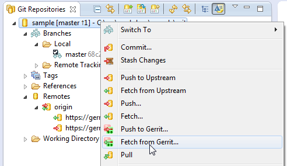
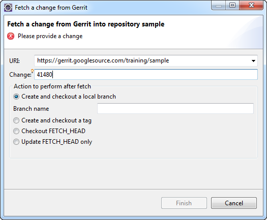
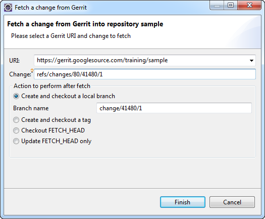
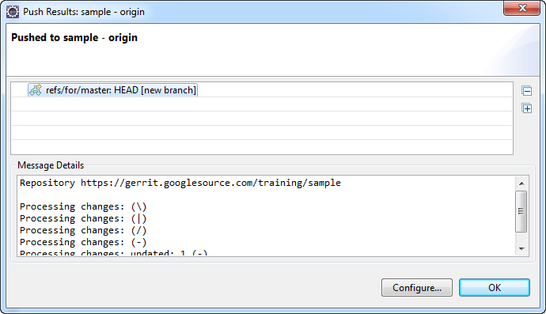

== Improve a change
This exercise shows how to improve a change that didn’t pass the code
review by submitting another patch set. Each (new) patch set is
another iterative improvement of the change. There could be several
rounds of improvements (new patch sets) until the change is ready to
be submitted to the code base.

=== Preparation

* There is a change that was reviewed and needs to be improved.
* Case-1: you are going to improve your own change.
* Case-2: you are going to improve a change started by someone else
  (who is not able to continue working on that change for some
  reason).

Depending on which case you choose, follow the link:#case-1[Case-1] or
the link:#case-2[Case-2] exercise. You may also try both exercises.

[[case-1]]
=== Case-1: Checkout your feature branch from where you pushed the patch set 1

* Make sure that you have a clean working directory. If you have
  uncommitted changes, commit them or do a hard reset to discard them.
* Make sure the feature branch is checked-out. If not double click the
  feature branch to check it out.

image::branch-checkout.png[Branch Checkout]

[[case-2]]
=== Case-2: Fetch the latest patch set of the change you want to improve

* Make sure that you have a clean working directory. If you have
  uncommitted changes, commit them or do a hard reset to discard them.
* To fetch the change that should be improved first note the numerical
  change ID of it. Look at the URL of the change in the web browser
  and locate the numerical Change ID:

image::numerical-change-id.png[Numerical Change ID]

In this case it is 127485.

* In Eclipse right-click the Git repository node and choose 'Fetch
  from Gerrit' from the context menu:
+

* In the 'Fetch a change from Gerrit' dialog enter the Change ID:
+

Then press 'Ctrl-Space' for auto-completion and choose the first item
from the list by either pressing 'Enter' or by double clicking the
item.

image::fetch-from-gerrit-3.png[Fetch from Gerrit]

* Choose the 'Create and checkout a local branch' option and enter a
  local branch name if you don’t like the default. For example you may
  name the local branch 'improve-divide-op' if you are going to
  continue working on the change that provides the divide operation:

=== Improving the Change

* From the web browser look at the change and read the comments
  written by the reviewer(s) and start improving the source code from
  Eclipse.
* When done with the improvements, commit the change. Make sure to
  choose the 'Amend Previous Commit' in the commit dialog:

image::commit-changes-with-amend.png[Commit Changes with Amend]

* *Don’t change* the already existing Change-Id footer! The Change-Id
  will be used by Gerrit to determine that you are pushing a next
  patch set for an already existing change.
* Click 'Commit' to commit your improvement in the local branch.

=== Push the next patch set

* Right-click the Git repository node and select 'Push to Upstream'
  from the context menu in order to push your commit to Gerrit:

image::push-to-upstream-2.png[Push to Upstream]

* A confirmation dialog pops-up and shows the result of the push:

* Visit your change in Gerrit Web UI and note that a 'Patch Set 2' was
  created:

image::patch-set-2.png[Patch Set 2]

* The patch set 2 is ready for code review. Find somebody to review
  the patch set 2 of your change.

The iterative process of review and providing a next patch set can be
repeated any number of times until reviewer(s) are satisfied with the
change and your change achieves highest votes in all voting categories
('Code-Review' and 'Verified' by default).
