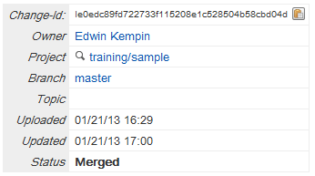

== Submit a change to the Codebase
This exercise shows how to submit a change to the codebase. 
For this a change must have successfully passed the code review, which means that:

* it got at least one highest possible vote in all voting categories
* and that there are no veto votes on any of the voting categories

=== Submitting the change

Pick one of the changes you reviewed and ensure that this change has the highest votes in all review categories and
that there are no veto votings in any of the voting categories.

To submit a change click the 'Submit Patch Set n' button on the change screen in the Gerrit WebUI:

image::submit.png[Submit]

There are 3 possible outcomes of the Submit action:

==== 1. The change is merged successfully
If the change merges without any conflicts you will see that the
status of the change changed to 'Merged'.

==== 2. The change is submitted but the merge is pending
If the status changed to 'Submitted, Merge Pending' then the change
depends on another change that is still open (in review). In that case
the change will be merged automatically once all its dependencies are
submitted and merged.

==== 3. The submit fails due to merge conflicts
It may also happen that the submit fails due to merge conflicts. In
that case you will have to resolve the merge conflicts in your local
branch and then push another patch set. The steps are:

* Fetch the changes from upstream. This updates the local 'origin/master' branch to
  its latest state. Rebase your feature branch to the 'origin/master'. If you get conflicts resolve 
  these conflicts.
* Commit your adjustments using the 'amend' option.
* Push to the upsteam again. 

* After that a new patch set is created for this change. The new patch
  set has again to pass the code reviewa again.
* Submit the change again once it passes the code review
