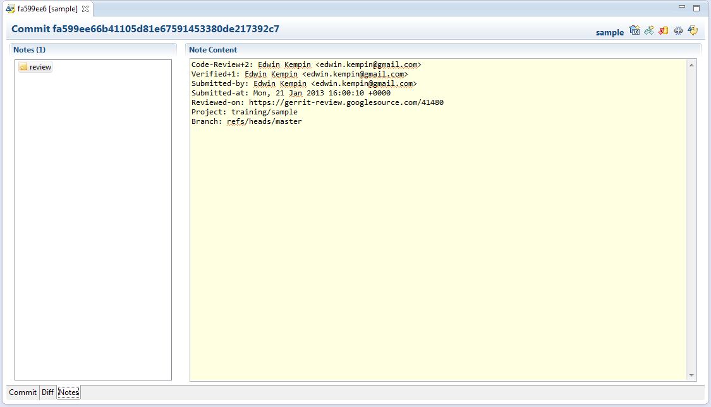

== View Gerrit Review Notes
This exercise shows how can view Gerrit review metadata in your local
Git Repository.

=== Preparation
You have configured your local Git Repository according to the Gerrit
exercise link:configure-push-to-gerrit.html[Configure Push to Gerrit].
This adds a fetch configuration that tells git to fetch the so-called
git notes when you fetch from upstream.

=== View Review Notes

* Fetch at least once after doing the Gerrit Configuration.

image::fetch-from-upstream.png[Fetch from Upstream]

* Now select 'Open in Commit Viewer' on a commit in the History View.

image::open-in-commit-viewer.png[Open in Commit Viewer]

* In the Commit Viewer you now have an additional tab 'Notes'. Here
  you see data which was created by Gerrit when the change was
  submitted:

