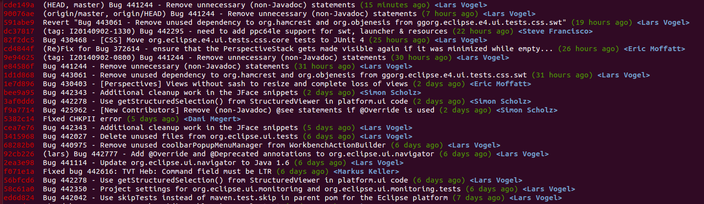

[[analyzechanges]]

= Analyzing the commit history with git log

[[analyzechanges_log]]

== Using git log

((git log))
 The `git log` command shows
the history of your repository in the current branch, i.e., the list of
commits.

[source,terminal]
----
include::./examples/log/log.txt[]
----

[[git_log_options]]
== Helpful parameters for git log
((git log, oneline))
((git log, abbrev-commit))
((git log, graph))

The `--oneline` parameter fits the
output of the `git log` command in one line.

If you use the `--abbrev-commit` parameter, the `git log` command uses
shorter versions of the SHA-1 identifier for a commit object but keeps
the SHA-1 unique. This parameter uses 7 characters by default, but you
can specify other numbers, e.g., `--abbrev-commit --abbrev=4` .

The `graph` parameter draws a text-based graphical representation of the
branches and the merge history of the Git repository.

[source,terminal]
----
include::./examples/log/logoptions.txt[]
----

For more options on the `git log` command see the
https://www.kernel.org/pub/software/scm/git/docs/git-log.html[Git log manpage].

[[analyzechangesg_changesinafile]]

== View the change history of a file

(((git log, File history)))
(((File history in Git)))

To see changes in a file you can use the `-p` option in the `git log` command.

[source,terminal]
----
include::./examples/changes/filechanges.txt[]
---- 

== Configuring output format \{#analyzechanges_output}

You can use the `--pretty` parameter to configure the output.

[source,terminal]
----
include::./examples/log/pretty.txt[]
----

This command creates the output.

 

You can define an alias for such a long command. See <<alias_definition>> for information how
to define an alias.

[[analyzechanges_grep]]

== Filtering based on the commit message via regular expressions

(((Search, Regular expression)))

You can filter the output of the `git log` command to commits whose commit message, or reflog entry,
respectively, matches the specified regular expression pattern with the `--grep=<pattern>` and `--grep-reflog=<pattern>` option.

For example the following command instructs the log command to list all commits which contain the word "workspace" in their commit message.

[source,terminal]
----
include::./examples/log/grep.txt[]
----

There is also the `--invert-grep=<pattern>` option. When this option is used, git
log lists the commits that don't match the specified pattern.

[[analyzechanges_user]]

== Filtering the log output based on author or committer

(((Changes by a certain author or committer)))

(((Search, Git commits by author or committer)))

You can use the `--author=<pattern>` or `--committer=<pattern>` to filter
the log output by author or committer. You do not need to use the full
name, if a substring matches, the commit is included in the log output.

The following command lists all commits with an author name containing
the word "lvogel".

[source,terminal]
----
include::./examples/log/loguser.txt[]
----

See also <<gitshortlog>>.
